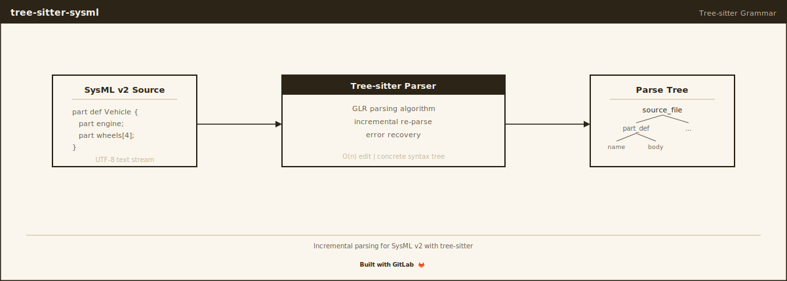

# tree-sitter-sysml

[](https://gitlab.com/nomograph/tree-sitter-sysml/-/pipelines)
[](LICENSE)

[](https://crates.io/crates/tree-sitter-sysml)
[](https://pypi.org/project/tree-sitter-sysml/)
[](https://www.npmjs.com/package/tree-sitter-sysml)
[](https://gitlab.com/nomograph/tree-sitter-sysml/-/pipelines)

[Tree-sitter](https://tree-sitter.github.io/) grammar for [SysML v2](https://www.omg.org/spec/SysML/2.0/), the next-generation systems modeling language from the OMG.

SysML v2 replaces the diagram-centric SysML v1 with a **textual notation** designed for Model-Based Systems Engineering (MBSE). This parser turns that textual notation into concrete syntax trees that editors, linters, and developer tools can consume.

## Why This Exists

SysML v2 is a large language — roughly 120 grammar rules covering packages, definitions, usages, constraints, requirements, state machines, actions, flows, views, and more. The only existing parser is the [Xtext-based pilot implementation](https://github.com/Systems-Modeling/SysML-v2-Pilot-Implementation) from the OMG, which is tightly coupled to Eclipse.

This tree-sitter grammar provides a **standalone, incremental parser** with no IDE dependency. Our primary use case is embedding it in **Rust CLI tools and MCP (Model Context Protocol) servers** for AI-assisted systems engineering — but it works anywhere tree-sitter does: Neovim, Helix, Zed, VS Code, Emacs, and any application using the tree-sitter C library.

## Status

Parse coverage is tested on every push against 421 real-world SysML v2 files from 9 independent sources (see badge above).

| Metric | Value |
|--------|-------|
| Corpus Tests | 192 passing |
| Negative Tests | 18 (12 syntactic, 6 structural) |
| External File Coverage | 421 files across 9 corpora |
| Bindings | C, Rust, Go, Python, Node.js, Swift |
| Queries | highlights, tags, locals, folds, indents |

See [parse-coverage.md](docs/parse-coverage.md) for per-corpus breakdown and details on any unparseable files.

## How the Corpus Was Assembled

Most tree-sitter grammars have the luxury of millions of open-source files to test against. SysML v2 does not — the language was published in 2023 and adoption is early. We assembled test material from every public source we could find:

| Source | Files | Description |
|--------|-------|-------------|
| [OMG Training](https://github.com/Systems-Modeling/SysML-v2-Release) `sysml/src/training/` | 100 | Official tutorial files covering all major constructs |
| [OMG Examples](https://github.com/Systems-Modeling/SysML-v2-Release) `sysml/src/examples/` | 95 | Additional worked examples from the spec authors |
| [OMG Validation](https://github.com/Systems-Modeling/SysML-v2-Release) `sysml/src/validation/` | 56 | Validation suite from the reference implementation |
| [OMG Standard Library](https://github.com/Systems-Modeling/SysML-v2-Release) `sysml.library/` | 58 | Library definitions (KerML + SysML base types) |
| [Sensmetry Advent](https://github.com/sensmetry/advent-of-sysml-v2) | 44 | Community examples from "Advent of SysML v2" |
| [GfSE Models](https://github.com/GfSE/SysML-v2-Models) | 36 | German systems engineering society models |
| [SYSMOD](https://github.com/MBSE4U/sysmod-sysmlv2-models) | 1 | SYSMOD methodology example |
| [Sensmetry SmartHome](https://github.com/sensmetry/smart-home-hub-example) | 3 | Smart home hub example |
| [Apollo 11](https://github.com/airbus/apollo-11-sysml-v2) | 28 | Airbus CoSMA framework -- 5 architectural layers, largest public real-world SysML v2 model |
| **Total** | **421** | |

The training files were the development target — every grammar change was validated against all 100 training files. The remaining corpora serve as independent validation: the grammar was never specifically tuned to pass them, so their pass rate reflects genuine generalization.

**We need more corpus.** If you have SysML v2 files (from coursework, research, industry projects, or personal experiments), we would love to test against them. Even files that break the parser are valuable — especially those. See [Contributing](#contributing).

## Grammar Approach

### The Brute-Force Strategy

This grammar was developed **empirically**, not derived from the SysML v2 KEBNF specification. The approach:

1. Start with the simplest possible grammar rules
2. Try to parse a training file
3. When it fails, look at the error, add or modify the rule
4. Regenerate, re-test all files, repeat

This "brute-force" loop ran for hundreds of iterations. The result is a grammar that reliably parses real SysML v2, but makes pragmatic trade-offs that a spec-derived grammar would not.

### Trade-offs

**Over-acceptance (deliberate).** The grammar does not enforce context-sensitive body rules. For example, a `control_node` (only valid inside action bodies) will parse without error inside a `part` body. This keeps the grammar simpler and more resilient to spec evolution, at the cost of accepting some invalid programs. Editors and linters should handle semantic validation — the parser's job is to produce a usable tree.

**Flat member lists.** Rather than maintaining separate member type lists for structural vs. behavioral contexts (which the spec requires), every body accepts a unified `_usage_member` rule. This avoids exponential conflict growth in the LR parse table.

**Expression precedence is approximated.** Binary operators use `prec.left` following standard mathematical convention, which may not match the SysML v2 spec in edge cases.

### Could This Be Done Better?

Almost certainly. Some ideas we haven't tried:

- **Derive the grammar from the KEBNF** — The SysML v2 specification includes a formal grammar in KEBNF notation. A careful translation to tree-sitter rules could produce a more precise parser, but KEBNF uses features (like ordered alternation) that don't map directly to tree-sitter's GLR parser.
- **Use an external scanner** — For constructs like implicit action bodies (brace-less blocks), an external scanner could maintain context state. We avoided this to keep the grammar self-contained.
- **Context-sensitive body rules** — Separate member lists per body type (structural, behavioral, etc.) would reject more invalid syntax but at significant grammar complexity cost.
- **Hybrid approach** — Use the empirical grammar as a baseline, then systematically tighten it against the KEBNF rule by rule.

If you have experience with tree-sitter grammars for large languages and want to suggest improvements to the approach, we'd welcome the discussion. Open an issue.

## Construct Coverage

| Category | Status | Constructs |
|----------|--------|------------|
| Packages | ✅ | `package`, `library package`, `import`, `alias` |
| Definitions | ✅ | `part`, `item`, `port`, `action`, `state`, `constraint`, `requirement`, `use case`, `interface`, `allocation`, `analysis`, `case`, `verification`, `occurrence`, `individual`, `connection`, `flow`, `attribute`, `enumeration`, `metadata` |
| Usages | ✅ | All definition types as usages, plus `ref`, `end`, `connect`, `bind`, `event occurrence`, `timeslice`, `snapshot`, `variant`, `exhibit`, `concern`, `stakeholder`, `actor`, `objective` |
| Specialization | ✅ | `:>`, `specializes`, `:>>`, `redefines`, `subsets`, `references` |
| Multiplicity | ✅ | `[n]`, `[n..m]`, `[n..*]`, `ordered`, `nonunique` |
| Comments | ✅ | `//`, `/* */`, `//* */`, `doc`, `comment about`, `locale` |
| Connections | ✅ | `connect`, `bind`, `interface`, `allocation` |
| Flows | ✅ | `flow`, `flow def`, `message`, `succession flow` |
| Actions | ✅ | `first`/`then`, `perform`, `accept`/`send`, `if`/`while`/`for`/`loop`, `assign`, `terminate` |
| States | ✅ | `state def`/`state`, `entry`/`do`/`exit`, transitions with triggers and guards |
| Constraints | ✅ | `constraint def`/`constraint`, `assert`, `require`, `assume` |
| Requirements | ✅ | `requirement def`/`requirement`, `satisfy`, `verify`, `subject`, `actor`, `stakeholder` |
| Expressions | ✅ | Arithmetic, comparison, logical operators, invocations, `select` (`.?`), `collect` (`.`), `index` (`#`) |
| Views | ✅ | `view`, `viewpoint`, `rendering`, `expose`, `filter` |
| Metadata | ✅ | `@metadata`, `#prefixAnnotation` |
| Variations | ✅ | `variation`, `variant` |
| Calculations | ✅ | `calc def`/`calc`, `return` |

## Installation

### Rust

```toml
[dependencies]
tree-sitter-sysml = "0.1"
```

### Node.js

```bash
npm install tree-sitter-sysml
```

### Go

```go
import "github.com/nomograph-ai/tree-sitter-sysml/bindings/go"
```

### Python

```bash
pip install tree-sitter-sysml
```

## Usage

### Rust

```rust
use tree_sitter::Parser;

fn main() {
    let mut parser = Parser::new();
    parser.set_language(&tree_sitter_sysml::LANGUAGE.into()).unwrap();

    let source = r#"
        package Vehicle {
            part def Engine {
                attribute horsePower : Real;
            }
            part engine : Engine;
        }
    "#;

    let tree = parser.parse(source, None).unwrap();
    println!("{}", tree.root_node().to_sexp());
}
```

### Node.js

```javascript
const Parser = require('tree-sitter');
const SysML = require('tree-sitter-sysml');

const parser = new Parser();
parser.setLanguage(SysML);

const tree = parser.parse(`
package Vehicle {
    part def Engine {
        attribute horsePower : Real;
    }
    part engine : Engine;
}
`);

console.log(tree.rootNode.toString());
```

### Python

```python
import tree_sitter_sysml as tssysml
from tree_sitter import Language, Parser

SYSML_LANGUAGE = Language(tssysml.language())
parser = Parser(SYSML_LANGUAGE)

tree = parser.parse(b"""
package Vehicle {
    part def Engine {
        attribute horsePower : Real;
    }
    part engine : Engine;
}
""")

print(tree.root_node.sexp())
```

## Project Layout

```
tree-sitter-sysml/
├── grammar.js              # The grammar definition (~2400 lines)
├── src/
│   ├── parser.c            # Generated parser (do not edit)
│   ├── grammar.json        # Generated grammar metadata
│   ├── node-types.json     # Generated node type definitions
│   └── tree_sitter/        # Tree-sitter C library headers
├── queries/
│   ├── highlights.scm      # Syntax highlighting queries
│   ├── tags.scm            # Code navigation (symbol tags)
│   ├── locals.scm          # Scope-aware variable resolution
│   ├── folds.scm           # Code folding regions
│   └── indents.scm         # Auto-indentation rules
├── test/
│   ├── corpus/             # 192 tree-sitter corpus tests
│   │   ├── actions.txt     #   Control flow, send, accept, assign
│   │   ├── attributes.txt  #   Attribute definitions and usages
│   │   ├── calculations.txt#   Calc definitions with return
│   │   ├── connections.txt #   Connect, bind, interface, allocation
│   │   ├── constraints.txt #   Constraint definitions and assertions
│   │   ├── definitions.txt #   All definition types
│   │   ├── expressions.txt #   Operators, invocations, special exprs
│   │   ├── flows.txt       #   Flow definitions and messages
│   │   ├── metadata.txt    #   Metadata annotations
│   │   ├── packages.txt    #   Packages, imports, aliases, comments
│   │   ├── requirements.txt#   Requirements, satisfy, verify
│   │   ├── states.txt      #   State machines, transitions
│   │   ├── successions.txt #   First/then succession chains
│   │   ├── usages.txt      #   All usage types
│   │   └── views.txt       #   Views, viewpoints, rendering
│   └── invalid/            # 18 negative tests (should fail to parse)
│       ├── syntactic/      #   12 tests: bad tokens, missing delimiters
│       └── structural/     #   6 tests: wrong nesting contexts
├── examples/               # 5 curated SysML v2 example files
│   ├── vehicle.sysml       #   Part definitions, attributes, ports
│   ├── requirements.sysml  #   Requirements with satisfy/verify
│   ├── state-machine.sysml #   State definitions with transitions
│   ├── use-cases.sysml     #   Use case with actors and objectives
│   └── verification.sysml  #   Verification with test cases
├── bindings/               # Language bindings
│   ├── c/                  #   C header and pkg-config
│   ├── rust/               #   Rust crate (lib.rs)
│   ├── go/                 #   Go module
│   ├── node/               #   Node.js addon + binding test
│   ├── python/             #   Python package + binding test
│   └── swift/              #   Swift package
├── scripts/
│   ├── fetch-corpora.sh    # Download external test corpora
│   ├── test-corpus.sh      # Run parser against external files
│   ├── check-test-count.sh # Verify corpus test count
│   ├── validate-external.sh# Validate against external corpora
│   └── validate-training.js# Validate against OMG training files
├── docs/
│   ├── parse-coverage.md   # Detailed coverage report and edge cases
│   └── prd-pre-submission.md # Development planning document
├── tree-sitter.json        # Tree-sitter configuration
├── package.json            # Node.js package metadata
├── Cargo.toml              # Rust crate metadata
├── pyproject.toml          # Python package metadata
├── go.mod / go.sum         # Go module metadata
├── CMakeLists.txt          # CMake build system
├── Makefile                # Make build system
├── binding.gyp             # Node.js native addon build
├── Package.swift           # Swift package definition
└── eslint.config.mjs       # ESLint config (tree-sitter conventions)
```

## Development

### Prerequisites

- Node.js 18+
- tree-sitter CLI: `npm install -g tree-sitter-cli`

### Quick Start

```bash
git clone https://gitlab.com/nomograph/tree-sitter-sysml.git
cd tree-sitter-sysml
npm install
npx tree-sitter generate   # ~2 minutes — the grammar is large
npx tree-sitter test        # 192 tests
```

### Parse a File

```bash
npx tree-sitter parse examples/vehicle.sysml
```

### Test Against External Corpora

```bash
bash scripts/fetch-corpora.sh          # Clone all external repos
bash scripts/test-corpus.sh all        # Parse every .sysml file
bash scripts/test-corpus.sh all --errors-only  # Show only failures
```

### Lint

```bash
npx eslint grammar.js
```

## Editor Support

### Neovim (nvim-treesitter)

```lua
require('nvim-treesitter.parsers').get_parser_configs().sysml = {
  install_info = {
    url = 'https://gitlab.com/nomograph/tree-sitter-sysml',
    files = { 'src/parser.c' },
    branch = 'master',
  },
  filetype = 'sysml',
}
```

### Helix

The grammar can be added to `languages.toml` once published to the tree-sitter org.

### Zed

Tree-sitter grammars in the tree-sitter org are automatically available in Zed.

## Intended Use: Rust CLI and MCP Tooling

This grammar was built to power a Rust-based CLI and [Model Context Protocol](https://modelcontextprotocol.io/) (MCP) server for AI-assisted systems engineering. The intended workflow:

1. **Parse** SysML v2 models into concrete syntax trees using `tree-sitter-sysml`
2. **Extract** structured information (definitions, relationships, requirements, constraints) via tree-sitter queries
3. **Serve** that information to LLMs through MCP, enabling AI assistants to understand and reason about system models
4. **Generate** SysML v2 from natural language descriptions, with the parser validating output

The Rust binding (`tree-sitter-sysml` crate) is the primary integration point. The grammar's over-accepting nature is actually an advantage here — when AI generates SysML, a lenient parser that produces a usable tree (even for slightly malformed output) is more useful than a strict parser that rejects it entirely.

## Contributing

Contributions are welcome. See [CONTRIBUTING.md](CONTRIBUTING.md) for detailed guidelines.

### What We Need Most

**More corpus files.** The biggest risk to this grammar is constructs we haven't seen. If you have SysML v2 files — from any source — please share them (or point us to public repositories). Files that break the parser are especially valuable.

To test your files against the grammar:

```bash
npx tree-sitter parse your-file.sysml
```

If it produces an ERROR node, please open an issue with the file (or a minimal reproducing snippet).

**Negative tests.** We have 18 tests for syntax that should be rejected. We need more — especially for:
- Invalid nesting (definitions inside usages, behavioral constructs in structural contexts)
- Malformed expressions
- Edge cases around keyword-as-identifier ambiguity

**Grammar approach feedback.** If you've built tree-sitter grammars for large languages and see a better way to structure ours, we want to hear it. The brute-force empirical approach got us to 98%, but there may be architectural improvements that would make the grammar more maintainable or more precise.

**Query improvements.** The highlight, tag, and local queries cover all node types, but the fold and indent queries are minimal. Contributions to improve editor integration are welcome.

### Priority Areas

| Area | Impact | Effort |
|------|--------|--------|
| Corpus contributions | High | Low |
| Negative test cases | High | Low |
| Query improvements (folds, indents) | Medium | Low |
| Specification alignment documentation | Medium | Medium |
| Context-sensitive body rules | High | High |

## Known Limitations

- **Over-acceptance**: Any member type parses in any body context (see [Grammar Approach](#grammar-approach))
- **6 unparseable files**: 2 intentionally unsupported, 4 regressions from OMG 2026-02 release (see [parse-coverage.md](docs/parse-coverage.md))
- **No semantic validation**: The parser checks syntax, not type correctness or constraint satisfaction
- **Expression precedence**: Approximated with left-association, may differ from spec in edge cases
- **Keyword-as-identifier**: Most cases handled, but some ambiguity remains (see [parse-coverage.md](docs/parse-coverage.md))

## References

- [SysML v2 Specification](https://www.omg.org/spec/SysML/2.0/)
- [SysML v2 Release Repository](https://github.com/Systems-Modeling/SysML-v2-Release) (training files, KEBNF, standard library)
- [SysML v2 Pilot Implementation](https://github.com/Systems-Modeling/SysML-v2-Pilot-Implementation) (Xtext reference parser)
- [Tree-sitter Documentation](https://tree-sitter.github.io/tree-sitter/)
- [Model Context Protocol](https://modelcontextprotocol.io/)

## Changelog

See [CHANGELOG.md](CHANGELOG.md) for release history.

## License

MIT

## Author

Andrew Dunn — [Nomograph Labs](https://gitlab.com/nomograph)

---
Built by Andrew Dunn, April 2026.
